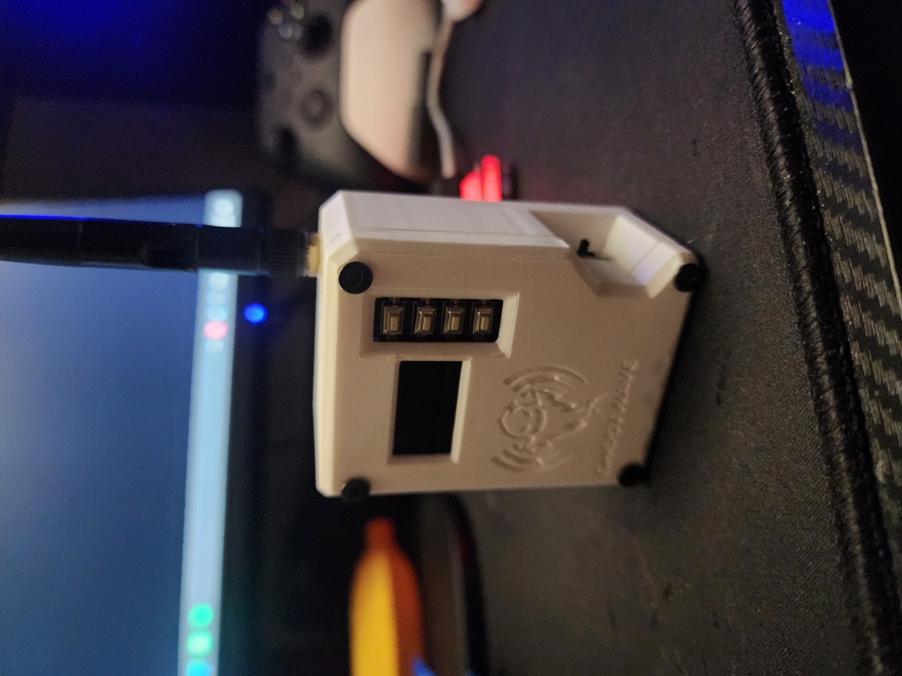

# GHOSTWAVE — Multi-Tool v3.0

BLE Spam + WiFi Attacks + Evil Portal + Web UI — everything for ESP32 with OLED 128×64.

---

## Hardware

| Element | Pin/Info |
|---------|----------|
| **Board** | ESP32-WROOM-32U (IPEX antenna) |
| **OLED** | SSD1306 128×64 I2C |
| SDA | GPIO 21 |
| SCL | GPIO 22 |
| **BTN UP** ▲ | GPIO 32 |
| **BTN DOWN** ▼ | GPIO 33 |
| **BTN OK** ● | GPIO 25 |
| **BTN BACK** ◄ | GPIO 26 |


```
  ESP32-WROOM-32U
  ┌─────────────────┐
  │  GPIO 21 (SDA) ─┼── SSD1306 SDA
  │  GPIO 22 (SCL) ─┼── SSD1306 SCL
  │  3.3V          ─┼── SSD1306 VCC
  │  GND           ─┼── SSD1306 GND
  │  GPIO 32       ─┼── BTN UP ──── GND
  │  GPIO 33       ─┼── BTN DOWN ── GND
  │  GPIO 25       ─┼── BTN OK ──── GND
  │  GPIO 26       ─┼── BTN BACK ── GND
  │  IPEX/U.FL     ─┼── Antena 2.4GHz
  └─────────────────┘
```

---

## Interfejs (UI)

### Boot Screen
```
┌────────────────────────┐
│                        │
│        GHOSTWAVE       │
│                        │
│                        │
│    Multi-Tool v2       │
│ ██████████████████████ │
└────────────────────────┘
```

### Main Menu
```
┌────────────────────────┐
│        GHOSTWAVE       │
│────────────────────────│
│ ┌────────────────────┐ │
│ │█ WiFi            >█│ │  ◄ zaznaczenie
│ └────────────────────┘ │
│ ┌────────────────────┐ │
│ │  Bluetooth        > │ │
│ └────────────────────┘ │
│ ┌────────────────────┐ │
│ │  Others           > │ │
│ └────────────────────┘ │
└────────────────────────┘
```

###  WiFi
```
┌────────────────────────┐
│█WiFi                  █│
│────────────────────────│
│ █Scan APs           █ │  ◄ 
│   Live Beacon          │
│   Deauth               │
│   Evil Portal          │
│────────────────────────│
│ OK=Go  BACK=Menu       │
└────────────────────────┘
```


### Bluetooth
```
┌────────────────────────┐
│█Bluetooth             █│
│────────────────────────│
│ █Spam All            █ │
│   Spam Samsung         │
│   Spam Windows         │
│   Spam Apple           │
│────────────────────────│
│ OK=Go  BACK=Menu       │
└────────────────────────┘
```


### Others
```
┌────────────────────────┐
│█Others                █│
│────────────────────────│
│ █Start Web UI        █ │
│   Stop Web UI          │
│   < Back               │
│────────────────────────│
│ OK=Go  BACK=Menu       │
└────────────────────────┘
```

### WiFi scan
```
┌────────────────────────┐
│█Scan: 12 APs         █│
│────────────────────────│
│ HomeWifi     -45   6   │
│█Office       -62   1 █│  ◄ zaznaczenie
│ Guest        -71  11   │
│ <Hidden>     -80   3   │
│────────────────────────│
│ OK=Deauth BK=Back      │
└────────────────────────┘
```

### Live Beacon Scan
```
┌────────────────────────┐
│█Live: 23 APs     ... █│
│────────────────────────│
│ NetworkOne   -32   1   │
│ WiFi-5G      -45   6   │
│ Hotspot      -58  11   │
│ MyRouter     -67   3   │
│────────────────────────│
│ BK=Stop  UP/DN=Scrl    │
└────────────────────────┘
```


### Evil Portal
```
┌────────────────────────┐
│█Evil Portal           █│
│────────────────────────│
│ AP: Free_WiFi          │
│ Clients: 2  Creds: 1   │
│─────────────────────── │
│ E:user@gmail.com       │  ◄ dane od razu
│ P:haslo123       NEW!  │  ◄ migające NEW!
│────────────────────────│
│    BACK = STOP         │
└────────────────────────┘
```


### Atak aktywny
```
┌────────────────────────┐
│    ATTACK ACTIVE       │
│────────────────────────│
│ BLE Spam ALL           │
│ Pkts: 1423             │
│                        │
│ ██████████░░░░░  anim  │
│────────────────────────│
│    BACK = STOP         │
└────────────────────────┘
```


